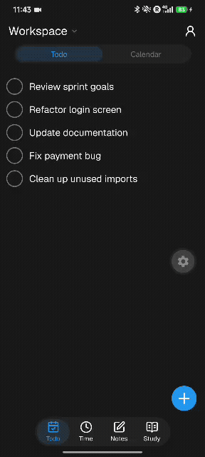
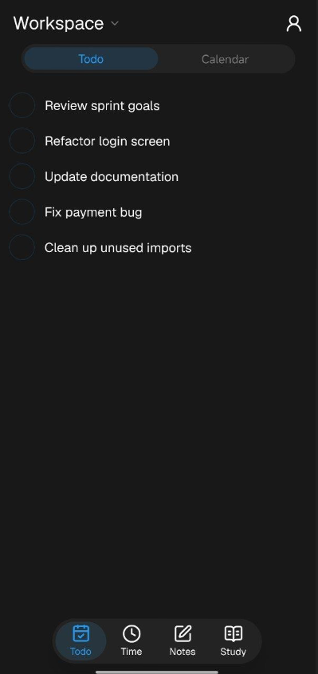
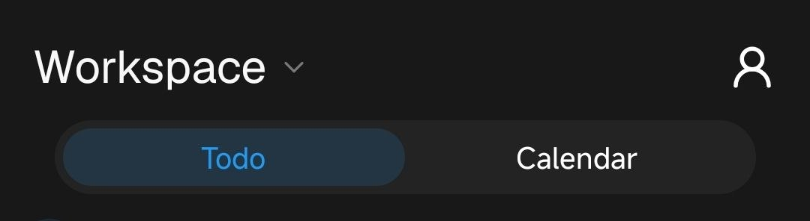

# Jaw — The Monolithic Workspace for Students

> **One app. Everything connected. Works offline.**

Jaw is a local-first, all-in-one workspace designed for students. Tasks, timers, notes, and study tools, not in separate silos, but deeply linked together.

Link a note inside a task. Attach a pomodoro to your assignment. Generate flashcards from your notes. It's one monolithic workspace where everything talks to everything.

---

### ✨ Preview

> First video demo — smooth modern transitions + workspace popup picker

<p align="center">
  
  <br />
  <em>Smooth transitions & workspace popup picker</em>
</p>

<details>
<summary>📹 Watch raw video / see screenshots</summary>

<p align="center">
  <video src="./screenshots/first-video.mp4" width="300" controls muted loop playsinline></video>
</p>

[▶️ `screenshots/first-video.mp4`](./screenshots/first-video.mp4) · [GIF](./screenshots/preview.gif)

| Todo preview | Header |
| :---: | :---: |
|  |  |

</details>

---

### Why Jaw?

Most productivity apps force you to juggle 5 different tools: Todoist for tasks, Anki for flashcards, Notion for notes, a pomodoro app for focus... Context switching kills productivity.

**Jaw fixes this with two principles:**

**1. Local-First**
Works 100% offline. No internet? No problem. Create tasks, write notes, run timers — everything works locally with SQLite. When you're back online, it syncs automatically (sync server with conflict resolution — WIP).

**2. All-in-One, Deeply Integrated**
It's not just 4 apps in one tab bar. Modules are linked on an entity level:
- Link a `Note` inside a `Task` description
- Attach a `Pomodoro Timer` to a `Task`
- Attach files and cross-link any entity to any other
- (Planned) Generate `Flashcards` directly from `Notes`

One workspace. Zero context switching.

---

### 🧩 The 4 Modules

| Module | What it does |
| :--- | :--- |
| **Todo / Planning** | Simple todo list by default. No complexity. Switch to **Calendar view** for curriculum, events, and repeatable tasks. |
| **Time** | Time management with Pomodoro timers, linkable to any task. |
| **Notes** | Fast-capture for ideas & knowledge. Attach files, link tasks/timers/other notes. |
| **Study** | Anki / Quizlet-style flashcards, interactive tests & games, with integrated AI. |

---

### 🛠️ Tech Stack

- **React Native + Expo** `~57.0.10` (Expo Router, Dev Client)
- **TypeScript**
- **Reanimated 4** + Gesture Handler + Worklets — for fluid animations
- **SQLite + Drizzle ORM** — local-first persistence
- **Jotai** — minimal state management
- **Design inspo:** Telegram — for its brilliant UX/UI and engineering

Check `package.json` and `app.json` for the full setup.

---

### 🚀 Getting Started

```bash
# 1. Install dependencies
npm install
# or
bun install

# 2. Start the dev server
npx expo start

# 3. Run on device
npx expo run:android
npx expo run:ios
```

Open in:
- [Development build](https://docs.expo.dev/develop/development-builds/introduction/)
- [Android emulator](https://docs.expo.dev/workflow/android-studio-emulator/)
- [iOS simulator](https://docs.expo.dev/workflow/ios-simulator/)
- [Expo Go](https://expo.dev/go) (limited sandbox)

> Requires Expo SDK 57. Read the [versioned docs](https://docs.expo.dev/versions/v57.0.0/) before writing code.

---

### 🗺️ Roadmap

- [x] Smooth transitions & workspace picker
- [x] Todo list foundation
- [ ] Complete SQLite integration (Drizzle)
- [ ] Fully local usable release
- [ ] Sync server — synchronization + conflict resolution
- [ ] Multi-user & public workspaces
- [ ] Live-editing for tasks, notes, timers

---

### 🎨 Design Feedback Wanted

I'm a developer, not a designer. If you have ideas on how to make Jaw more user-friendly and responsive, please open an issue or discussion — I'd love to hear it!

---

### 📄 License

Private WIP. More info soon.

---

<p align="center">Built with ❤️ — more devlogs coming soon!</p>
